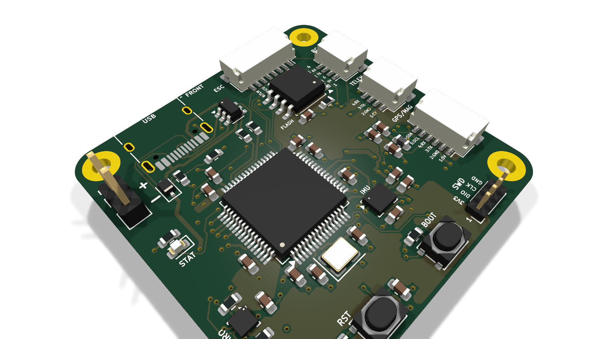
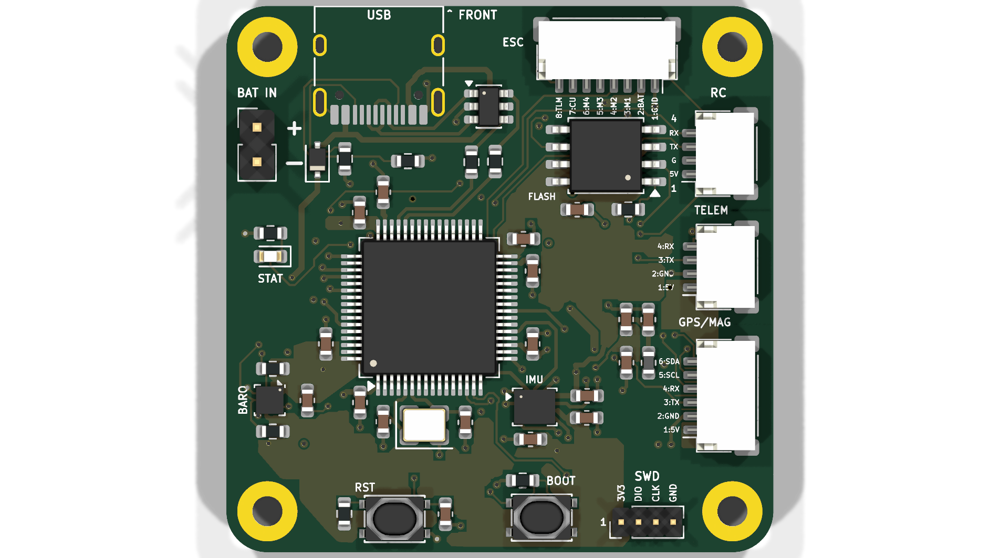
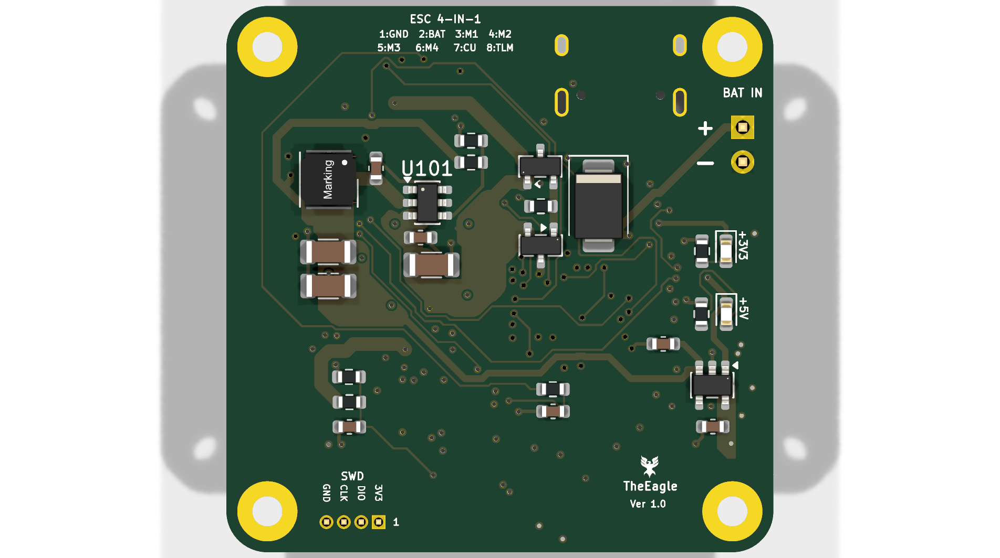

# The Eagle — Custom STM32F405 Autonomous Flight Controller

[](https://www.kicad.org/)
[-orange.svg)](https://www.st.com/en/microcontrollers-microprocessors/stm32f405-415.html)
[]()
[]()
[](LICENSE)

**The Eagle** is a custom, 4-layer high-reliability avionics flight controller (FC) designed around the **STMicroelectronics STM32F405RGT6** microcontroller. Engineered for autonomous Unmanned Aerial Vehicles (UAVs) and high-performance robotics platforms, the board integrates high-bandwidth IMU telemetry, multi-stage power conditioning, blackbox high-rate logging, and deterministic motor signaling into a **40.0 × 40.0 mm** board footprint with a **34.0 × 34.0 mm** mounting hole pattern.

---

## 3D Isometric View

<p align="center">
  
</p>

---

## Hardware Gallery & Subsystems

| Top View (Components & Silicon) | Bottom View (Power Stages & Silkscreen) |
| :---: | :---: |
|  |  |
| *MCU, IMU, Baro, Flash, SWD, and I/O headers* | *Buck Regulator, LDO, TVS Diode, Reverse-Polarity FET, ESC pads* |

---

## Engineering Highlights & Key Specifications

### 1. Compute & Core Architecture
* **Primary MCU:** STM32F405RGT6 (ARM Cortex-M4 with single-precision FPU, 168 MHz core clock, 1 MB Flash, 192 KB SRAM).
* **Clocking:** External 8.000 MHz crystal oscillator feeding the internal PLL for zero-jitter core timing and USB 48 MHz generation.
* **Programming & Debug:** Onboard 4-pin SWD header (`3V3`, `SWDIO`, `SWCLK`, `GND`) for ST-Link / J-Link debugging and automated CI flashing.
* **Boot Management:** Hardware `BOOT` and `RST` tactile buttons supporting USB DFU system recovery.

### 2. Sensor Suite & Signal Integrity
* **Primary IMU:** **TDK InvenSense ICM-42688-P** 6-axis MEMS gyroscope/accelerometer on a dedicated high-speed **SPI1** bus (up to 20 MHz).
* **Interrupt Routing:** Dedicated hardware `EXTI` Data-Ready (`DRDY`) interrupt line tied directly to the MCU NVIC for deterministic 8 kHz loop timing.
* **Barometric Altimeter:** **Bosch Sensortec BMP390** precision pressure sensor on **I2C1** for sub-meter altitude hold.
* **Blackbox Storage:** **Winbond W25Q128JVSSIQ** (128 Mbit / 16 MB) SPI NOR Flash on **SPI3** for high-rate loop and telemetry logging.
* **Bus Isolation:** SPI and I2C signal traces are referenced directly to an unbroken Layer 2 Ground Plane to suppress crosstalk and high-frequency noise.

### 3. Power Distribution Network (PDN)
* **Battery Input:** 3S–6S LiPo input (9.0V to 26.0V nominal; rated up to 36V transient tolerance).
* **Transient Voltage Suppression (TVS):** Onboard **SMBJ28A** high-energy TVS clamp at the main battery junction to suppress motor inductive voltage spikes.
* **Reverse Polarity Protection:** P-channel MOSFET gate protection preventing accidental battery reverse-connection damage.
* **Synchronous Buck Converter:** Texas Instruments **LMR51430** step-down regulator delivering clean 5.0V @ 3.0A for receivers, telemetry, and peripheral rails.
* **Ultra-Low-Noise Sensor LDO:** Texas Instruments **TLV75733PDBV** (3.3V @ 1.0A) high-PSRR linear regulator exclusively isolating the analog sensors and MCU core.
* **Analog Telemetry:** Low-pass RC filtered 11:1 voltage divider (`VBAT_SENSE`) and ESC analog current input (`CURR_SENSE`).
* **USB Interface:** Micro-USB / USB-C pads protected by ST **USBLC6-2SC6** ultra-low capacitance bidirectional ESD suppressor.

---

## Silicon Registry & Pin Allocation Matrix

| Pin | Function | Peripheral Bus | Alternate Function | Purpose / Notes |
| :--- | :--- | :--- | :--- | :--- |
| **PA0** | `CURR_SENSE` | ADC1 | `ADC1_IN0` | Analog current sensing from ESC |
| **PA1** | `VBAT_SENSE` | ADC1 | `ADC1_IN1` | 11:1 voltage divider battery monitor |
| **PA4** | `IMU_CS` | GPIO | Output | Active-Low SPI Chip Select (ICM-42688-P) |
| **PA5** | `IMU_SCK` | SPI1 | `SPI1_SCK` | High-speed IMU clock (up to 20 MHz) |
| **PA6** | `IMU_MISO` | SPI1 | `SPI1_MISO` | IMU Master In / Slave Out |
| **PA7** | `IMU_MOSI` | SPI1 | `SPI1_MOSI` | IMU Master Out / Slave In |
| **PB0** | `MOTOR_1` | TIM3 | `TIM3_CH3` | Motor 1 output (DShot300/600 / PWM with DMA) |
| **PB1** | `MOTOR_2` | TIM3 | `TIM3_CH4` | Motor 2 output (DShot300/600 / PWM with DMA) |
| **PB4** | `MOTOR_3` | TIM3 | `TIM3_CH1` | Motor 3 output (DShot300/600 / PWM with DMA) |
| **PB5** | `MOTOR_4` | TIM3 | `TIM3_CH2` | Motor 4 output (DShot300/600 / PWM with DMA) |
| **PB6** | `I2C1_SCL` | I2C1 | `I2C1_SCL` | Barometer (BMP390) & External Magnetometer |
| **PB7** | `I2C1_SDA` | I2C1 | `I2C1_SDA` | Barometer (BMP390) & External Magnetometer |
| **PB10** | `UART3_TX` | USART3 | `USART3_TX` | ESC Telemetry / Auxiliary Serial |
| **PB11** | `UART3_RX` | USART3 | `USART3_RX` | ESC Telemetry / Auxiliary Serial |
| **PA9** | `UART1_TX` | USART1 | `USART1_TX` | High-speed Telemetry / Radio Control link |
| **PA10** | `UART1_RX` | USART1 | `USART1_RX` | High-speed Telemetry / Radio Control link |
| **PA2** | `UART2_TX` | USART2 | `USART2_TX` | GPS Receiver (UBX / NMEA protocol) |
| **PA3** | `UART2_RX` | USART2 | `USART2_RX` | GPS Receiver (UBX / NMEA protocol) |
| **PC10** | `FLASH_SCK` | SPI3 | `SPI3_SCK` | Blackbox Flash Clock |
| **PC11** | `FLASH_MISO`| SPI3 | `SPI3_MISO`| Blackbox Flash Data Out |
| **PC12** | `FLASH_MOSI`| SPI3 | `SPI3_MOSI`| Blackbox Flash Data In |
| **PD2** | `FLASH_CS` | GPIO | Output | Blackbox Flash Chip Select (W25Q128) |
| **PA11** | `USB_DM` | USB OTG FS | `OTG_FS_DM` | USB D- with ESD Clamping |
| **PA12** | `USB_DP` | USB OTG FS | `OTG_FS_DP` | USB D+ with ESD Clamping |
| **PA13** | `SWDIO` | SWD | `SWDIO` | Serial Wire Debug Data |
| **PA14** | `SWCLK` | SWD | `SWCLK` | Serial Wire Debug Clock |

---

## PCB Stackup & Fabrication Rules

* **Dimensions:** 40.00 mm × 40.00 mm outer footprint
* **Mounting Pattern:** 34.00 mm × 34.00 mm grid (M2 mounting pads)
* **Layer Count:** 4 Layers (Standard 1.6 mm FR-4 Stackup):
  * **Layer 1 (Top):** Component placement & High-Speed Signal routing
  * **Layer 2 (Inner 1):** Solid Ground Plane (GND) for low return-loop inductance
  * **Layer 3 (Inner 2):** Power Plane split (5.0V / 3.3V power distribution)
  * **Layer 4 (Bottom):** Power Switching Stages, ESC pads, and secondary signal traces
* **Minimum Trace / Space:** 0.15 mm / 0.15 mm (6 mil / 6 mil)
* **Minimum Drill:** 0.3 mm (via size: 0.6 mm outer diameter)
* **Design Rule Check (DRC):** **0 Errors, 0 Unconnected Nets**

---

## Manufacturing & Project Deliverables

All production assets are pre-generated and included in this repository:

* 📄 **Schematic (PDF):** [`schematic/TheEagle_Schematic.pdf`](schematic/TheEagle_Schematic.pdf)
* 📐 **Schematic (SVG):** [`schematic/TheEagle_Schematic.svg`](schematic/TheEagle_Schematic.svg)
* 📦 **Fabrication Gerbers & Drill (ZIP):** [`manufacturing/TheEagle_Gerbers_Rev1.zip`](manufacturing/TheEagle_Gerbers_Rev1.zip)
* 📋 **Bill of Materials (BOM CSV):** [`manufacturing/TheEagle_BOM.csv`](manufacturing/TheEagle_BOM.csv)
* 💻 **KiCad Source Files:** Located in [`hardware/`](hardware/)

---

## Firmware Compatibility

The hardware layout and pin allocation strictly adhere to the STM32 timer and peripheral mapping required by standard flight controller firmware:

1. **ArduPilot (ChibiOS):** Fully compatible via standard ChibiOS `hwdef.dat` board definition.
2. **Betaflight / INAV:** Compatible using STM32F405 target configuration with DShot DMA timer assignment.
3. **Custom Bare-Metal C++ / MATLAB Simulink:** Direct code generation via Embedded Coder / HAL drivers using the onboard SWD debug interface.

---

## How to Open in KiCad

1. Clone this repository:
   ```bash
   git clone https://github.com/sbbxiii/The-Eagle.git
   cd The-Eagle/hardware
   ```
2. Open `AeroHawk_FC.kicad_pro` using **KiCad 8.0 or newer** (tested on KiCad 10.0).
3. View schematics in `Eeschema` or board layout in `Pcbnew`.

---

## Author & License

Designed by **Osakwe**.  
Licensed under the [MIT License](LICENSE).
